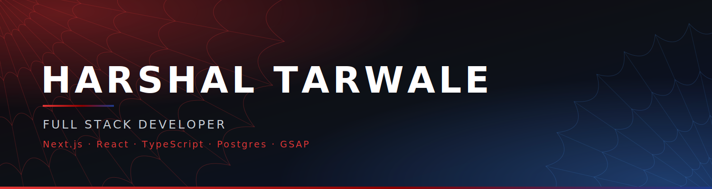
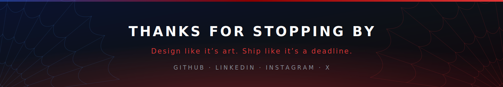

<!-- ═══════════════════════════════════════════════════════════════
     HARSHAL TARWALE · GITHUB PROFILE README
     Palette: crimson #E23636 · deep blue #1E3A8A · void #0D1117

     ⚠️  BANNER ART lives in assets/banner.png and assets/footer.png.
     To go back to the auto-generated wave instead, see setup notes.
     ═══════════════════════════════════════════════════════════════ -->



<div align="center">

<a href="https://github.com/HarshalTarwale">
  
</a>

<br/><br/>


</div>


<!-- ═══════════════ WHOAMI ═══════════════ -->

## ⚡ `whoami`

```ts
const harshal = {
  role       : "Full Stack Developer",
  year       : "3rd-year CS undergrad",
  frontend   : ["Next.js", "React", "TypeScript", "Tailwind", "GSAP"],
  backend    : ["Node", "Express", "Postgres", "Drizzle", "WebSockets"],
  obsession  : "interfaces that feel expensive",
  shipped    : "client sites, end to end",
  status     : "open for paid internships 🚀"
};
```

> Frontend that makes people stop scrolling, backend that keeps it standing up. Design in Figma, build in Next.js, ship to a live domain — the whole loop, solo.


<!-- ═══════════════ SOCIALS ═══════════════ -->

## 🔗 `connect.with(me)`

<div align="center">

<a href="https://github.com/HarshalTarwale"></a>
<a href="https://www.linkedin.com/in/harshaltarwale/"></a>
<a href="https://www.instagram.com/harshal.tarwale/"></a>
<a href="https://x.com/harshal_tarwale"></a>

</div>


<!-- ═══════════════ STACK ═══════════════ -->

## 🛠 `languages & tools`

<div align="center">

### Core Languages


### Frontend


### Backend, Data & Auth

<br/>


### Motion & Interaction


### Tooling & Deploy

<br/>


</div>


<!-- ═══════════════ STATS ═══════════════ -->

## 📊 `the numbers`

<div align="center">


<br/><br/>


<br/><br/>


<br/><br/>

<picture>
  <source media="(prefers-color-scheme: dark)" srcset="https://raw.githubusercontent.com/HarshalTarwale/HarshalTarwale/output/snake-dark.svg" />
  
</picture>

</div>


<!-- ═══════════════ FLAGSHIPS ═══════════════ -->

## 🚀 `flagship builds`

<div align="center">

| Project | Stack | Live |
|:---|:---|:---:|
| **[Tech Monkeys](https://github.com/HarshalTarwale/Tech-Monkeys)**<br/><sub>Full agency site — App Router, React Compiler, Resend mailer, Playwright-tested</sub> | `Next.js` `TypeScript` `Tailwind v4` `Motion` | [**↗**](https://tech-monkeys.vercel.app/) |
| **[Da-Reality](https://github.com/HarshalTarwale/Da-reality)**<br/><sub>My most full-stack build — Neon Postgres, Drizzle ORM, live WebSocket layer</sub> | `Next.js` `Drizzle` `Neon` `WebSockets` | [**↗**](https://da-reality.vercel.app) |
| **[Advenco](https://github.com/HarshalTarwale/Advenco-)**<br/><sub>Large-scale production site — 1.5M+ characters of TypeScript</sub> | `Next.js` `TypeScript` `Tailwind` | [**↗**](https://advenco.vercel.app/) |

</div>


<!-- ═══════════════ CURRENTLY ═══════════════ -->

## 💼 `currently`

```diff
+ Building websites for clients — brief to blank canvas to live domain.
+ Design it, code it, deploy it, hand over the keys. One person, whole pipeline.
+ Every build ships fast, loads faster, and looks like it cost more than it did.

! Taking on new client work and paid internships — my DMs are open.
```


<div align="center">

<!-- ⚠️  FOOTER ART -->



</div>
